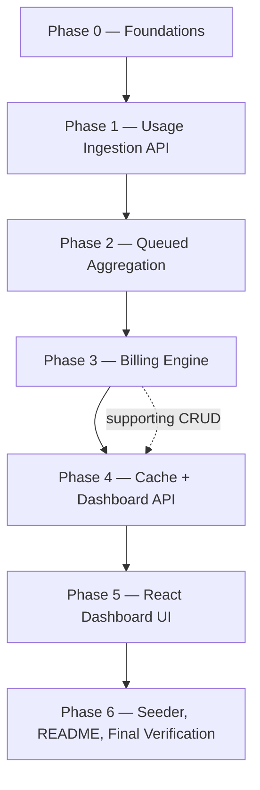

# Plan Briefs — Subscription Billing & Usage-Metering Platform

Source of truth: [`IMPLEMENTATION_PLAN.md`](../../../IMPLEMENTATION_PLAN.md) (referenced below as "Plan §x").
These briefs break the plan into **self-contained, sequentially executable phases**. Work them **in order, one by one**. Each phase ends green: migrations run, Pint clean, PHPStan clean, its tests pass.

---

## Phase Flow



| #   | Brief                                                            | Goal (one line)                                                                                   | Est.  | Status |
| --- | ---------------------------------------------------------------- | ------------------------------------------------------------------------------------------------- | ----- | ------ |
| 0   | [phase-0-foundations.md](phase-0-foundations.md)                 | Config + core domain schema (plans, customers, subscriptions, segments) + models/factories        | 0.5 d | ✅     |
| 1   | [phase-1-usage-ingestion.md](phase-1-usage-ingestion.md)         | Idempotent `POST /api/usage` with API-key auth, rate limiting, tenant checks                      | 0.5 d | ✅     |
| 2   | [phase-2-aggregation.md](phase-2-aggregation.md)                 | Queued, chunked, retry-safe `usage_events` → `daily_usage` aggregation                            | 0.5 d | ✅     |
| 3   | [phase-3-billing-engine.md](phase-3-billing-engine.md)           | Proration + overage + segmented billing → invoices; plan-change handling; supporting CRUD         | 1 d   | ✅     |
| 4   | [phase-4-cache-dashboard-api.md](phase-4-cache-dashboard-api.md) | `PlanPricingCache` with write-through invalidation + `DashboardService` + dashboard JSON endpoint | 0.5 d | ✅     |
| 5   | [phase-5-frontend.md](phase-5-frontend.md)                       | Team-scoped Inertia dashboard: top-5 usage, projected overage, churn risk                         | 0.5 d | ✅     |
| 6   | [phase-6-polish-docs.md](phase-6-polish-docs.md)                 | Demo seeder, README (architecture/assumptions/trade-offs), full-suite verification                | 0.5 d | ✅     |

**Status legend:** ⬜ not started · 🚧 in progress · ✅ done (all acceptance criteria checked)

---

## Working Agreement (per phase)

1. Read the phase brief fully before writing code. Do not pull work forward from later phases.
2. Each numbered task is atomic: implement → verify → tick.
3. After any PHP edit: `vendor/bin/pint --dirty --format agent` and `vendor/bin/phpstan analyse` (as configured).
4. After adding routes referenced by React: regenerate Wayfinder (`php artisan wayfinder:generate`).
5. Run the narrowest test set (`vendor/bin/pest <file> --filter=<name>`); ask user for full `php artisan test --compact` at phase end.
6. When a phase completes: update the Status table above and check every acceptance box in the brief.
7. **Decision IDs** (`D0.1`, `D3.2`, …) are locked choices. Never silently change one — flag it, update the brief, and note the reason.

---

## Shared Conventions (apply to every phase)

### Tenancy & identity

- **C0.1 — Merchant = Team.** The existing `teams` table/model **is** the merchant/tenant (Plan §11 Phase 0: "extend existing"). All `merchant_id` foreign keys in Plan §3 reference `teams.id`. No new merchants table. Rationale: teams + membership + slugs + `EnsureTeamMembership` middleware already exist; duplicating tenancy would fight the starter kit. _(Decision D0.1)_
- **C0.2 — API auth.** Machine API (`/api/*`) authenticates via `X-Api-Key` header → `api_keys` table (sha-256 hash lookup) → resolves the merchant (Team). Web dashboard continues using session auth + team context.

### Correctness & math

- **C0.3 — Money.** Columns are `decimal(12,2)`; all arithmetic happens in **integer cents** (and integer basis-points for `overage_rate`, 4 dp). Rounding is **half-up, per invoice line**; `invoice.total = Σ rounded line totals`. Never use floats for money. _(Decision D3.1 — fills gap in Plan §4.2)_
- **C0.4 — Dates.** Billing cycles and segments are date-based, half-open `[start, end)`, computed in **UTC**. Segment `ends_at` is exclusive. A day `d` belongs to the segment where `starts_at <= d < ends_at`.
- **C0.5 — Prorated allowance.** `included_units` prorate with the same fraction as the base price, rounded half-up to whole units. _(Decision D3.3)_
- **C0.6 — Usage types.** `usage_events.type` is informational; `daily_usage` and billing totals aggregate **all types together** against one allowance (schema in Plan §3.2 has no per-type dimension). _(Decision D0.3)_

### Environment reality (differs from Plan assumptions — verified in repo)

- **C0.7 — Tests run on sqlite `:memory:` with `QUEUE_CONNECTION=sync`** (see `phpunit.xml`). Therefore: app code shared by tests must stay portable across sqlite/PostgreSQL (avoid PG-only SQL; partial indexes via `CREATE INDEX … WHERE` are fine on both). Jobs execute inline in tests.
- **C0.8 — Local runtime targets PostgreSQL + Redis** via `.env` (Plan §1), but Herd/Windows may not have Redis running: configure `QUEUE_CONNECTION=redis` with a documented fallback to `database`, `CACHE_STORE` redis → `file` fallback. Tests are unaffected (phpunit.xml overrides). Document both in README (Phase 6).
- **C0.9 — `routes/api.php` does not exist yet.** It is created in Phase 1 and registered in `bootstrap/app.php` via `->withRouting(api: …)`.

### Code style (from existing codebase)

- Models: `final class`, `declare(strict_types=1)`, `#[Fillable([...])]` attribute, PHPDoc `@property` / `@property-read` annotations, `HasFactory`, relations with full generics PHPDoc (see `app/Models/Team.php`).
- Enums: `app/Enums`, TitleCase cases.
- Actions: `app/Actions/<Domain>/…` (existing convention). Services (Billing/Proration/Dashboard/Cache) go in `app/Services/**` — **new top-level folder approved by Plan §2 architecture**.
- DTOs / value objects: `app/Data/**` (existing convention: `UserTeam`, `TeamPermissions`) — `final readonly class` with promoted properties. Services depend on DTOs; DTOs never depend on services.
- Controllers: thin; delegate to actions/services. API controllers under `app/Http/Controllers/Api/`.
- Jobs: `app/Jobs/**` (new — approved by Plan §2).
- Tests: Pest, `php artisan make:test --pest <Name>Test` (no directory prefix in the name).
- Frontend: React + Inertia v3, pages in `resources/js/pages`, typed props, Wayfinder imports from `@/routes` / `@/actions`.

### File map (everything this project will create)

```
config/billing.php
app/Enums/{SubscriptionStatus,InvoiceStatus}.php
app/Models/{Plan,Customer,Subscription,SubscriptionSegment,UsageEvent,DailyUsage,Invoice,InvoiceItem,ApiKey}.php
app/Actions/Billing/{RecordUsageAction,ChangeSubscriptionPlanAction,CreateSubscriptionAction,GenerateInvoiceAction}.php
app/Actions/Usage/AggregateDailyUsageAction.php
app/Data/PlanPricing.php
app/Services/{ProrationService,BillingService,DashboardService,PlanPricingCache}.php
app/Jobs/{AggregateDailyUsageJob,GenerateInvoiceJob}.php
app/Http/Middleware/ResolveApiKey.php
app/Http/Requests/Api/RecordUsageRequest.php
app/Http/Controllers/Api/{UsageController,PlanController,CustomerController,SubscriptionController,DashboardController}.php
app/Console/Commands/CreateApiKeyCommand.php
routes/api.php
database/factories/*.php            (one per model)
database/seeders/BillingDemoSeeder.php
resources/js/pages/dashboard.tsx    (extended) + resources/js/components/billing/*
thoughts/shared/plans/*.md          (these briefs)
```

---

## Gap-Fill Decisions (not covered by the Plan — locked here)

| ID   | Decision                                                                                                                                                | Phase |
| ---- | ------------------------------------------------------------------------------------------------------------------------------------------------------- | ----- |
| D0.1 | Merchant = existing `teams` table                                                                                                                       | 0     |
| D0.2 | API keys: `api_keys` table (sha-256 hashed, `X-Api-Key` header), artisan command to mint                                                                | 1     |
| D0.3 | Usage `type` not billed separately; one aggregate allowance per subscription                                                                            | 0     |
| D1.2 | `POST /api/usage` requires an **active subscription covering `usage_date`** for the customer → else 422                                                 | 1     |
| D3.1 | Integer cents + basis points; half-up rounding per invoice line                                                                                         | 3     |
| D3.3 | Prorated allowance rounded half-up to whole units                                                                                                       | 3     |
| D3.4 | Segment with zero usage still bills its prorated base (a plan was in force)                                                                             | 3     |
| D3.5 | Idempotent invoicing: unique `(subscription_id, period_start)` on `invoices`                                                                            | 3     |
| D4.2 | Dashboard JSON endpoint accepts API-key **or** team-authenticated session                                                                               | 4     |
| D5.1 | Dashboard UI extends the existing team-scoped `/{current_team}/dashboard` Inertia page; data arrives as props from `DashboardService` (no client fetch) | 5     |
